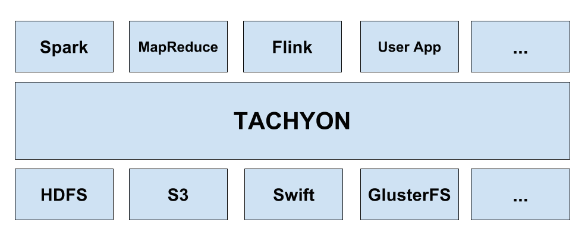

* Table of Contents
{:toc}

# Where Tachyon Fits

Tachyon holds a unique place in the big data ecosystem, residing between traditional storage and
computation frameworks and applications. For user applications and computation frameworks, Tachyon
manages data access and fast storage, facilitating data sharing and locality between jobs,
regardless of whether they are running with the same computation engine. Because of Tachyon's memory
centric design and being the central point of access, Tachyon can bring an order of magnitude speed up
for big data applications while providing a common data access interface. For under storage systems,
Tachyon redefines the set of workloads available to utilize the data. Since Tachyon hides the
integration of under storage systems to applications, any under storage can back all the
applications and frameworks running on top of Tachyon. Coupled with the potential to mount multiple
under storage systems, Tachyon can serve as a unifying layer for any number of varied data sources.

# Tachyon's Components

Tachyon's design uses a single master and multiple workers. At a very high level, Tachyon can be devided
into three components, the [master](#master), [workers](#worker), and [clients](#client). The master
and workers together make up the Tachyon servers. These will be the components a system admin would
maintain and manage. The clients will generally be applications, such as map-reduce jobs or command-line 
users. Every user of Tachyon will only need to interact with the client portion of Tachyon.

### Master

Tachyon may be deployed in one of two master modes, [single master](Running-Tachyon-Locally.html) or
[multiple masters (one primary plus standbys)](Running-Tachyon-Fault-Tolerant-on-EC2). The master is 
primarily responsible for managing the global metadata of the system, for example, the file system tree.
Clients may interact with the master to obtain or modify this metadata. In addition, all workers
periodically heartbeat to the master to maintain their participation in the cluster. The master
does not iniatiate communication with other components; it only interacts with other components by
responding to requests.

### Worker

Tachyon workers are responsible for [managing local resources](Tiered-Storage-on-Tachyon.html)
allocated to Tachyon. These resources could be local memory, SSD, or hard disk and are user
configurable. Tachyon workers store data as blocks and serve requests from clients to read or write
data by reading or creating new blocks. However, the worker is only responsible for the data in
these blocks; the actual block id and the file to block mapping are stored in the master.

### Client

The Tachyon client provides a means of interacting with the Tachyon servers. It exposes a
[file system API](File-System-API.html). In addition to metadata operations, it is also responsible
for initiating data connections to read and write data. This includes both contacting the Tachyon
worker for data stored in Tachyon as well as using an under storage client when the data is not
available in Tachyon.
