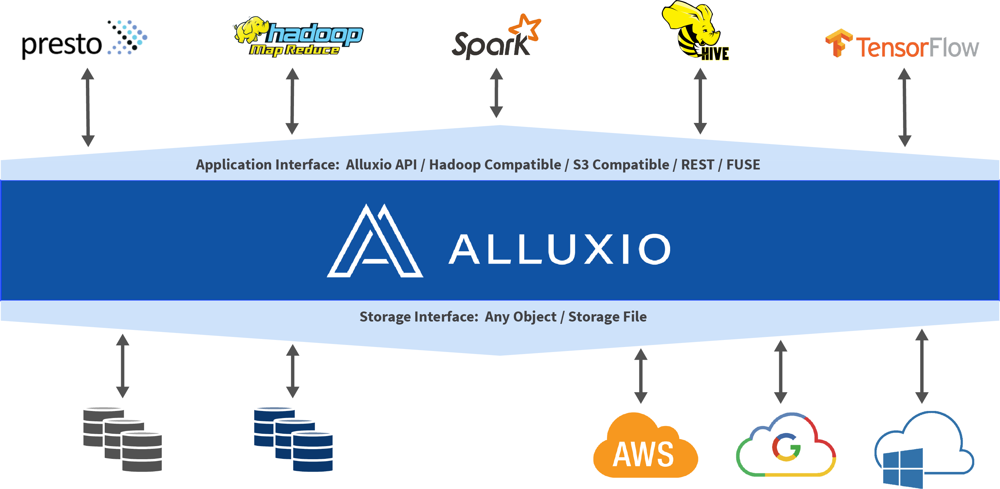

* Table of Contents
{:toc}

# Where Tachyon Fits

Tachyon holds a unique place in the big data ecosystem, resting between traditional storage and computation frameworks. Tachyon serves as an accelerator for data access by managing fast storage throughout the entire cluster. This facilitates data sharing and leveraging locality between jobs regardless if they are running with the same computation engine. In addition, it provides an abstraction to higher level frameworks, allowing access to data through a common interface. Finally, Tachyon connects different under storage systems thereby enabling any storage an easy way to integrate with all computation and/or application layers that would interface with Tachyon.

# Tachyon's Components

Tachyon has a traditional master - worker design pattern. Tachyon can be roughly divided into three components, the [master](#master), [workers](#worker), and [clients](#client). The master and workers together make up the Tachyon servers. These will be the components a system admin would maintain and manage. The clients will generally be applications, such as map-reduce jobs or command line users. Every user of Tachyon will only need to interact with the client portion of Tachyon.

### Master

Tachyon may be deployed in one of two master modes, [single master](Running-Tachyon-Locally.html) or [multi-master with standbys](Running-Tachyon-Fault-Tolerant-on-EC2). The master is primarily responsible for managing the global metadata of the system, for example, the file system tree. Clients may interact with the master to obtain or modify this metadata. In addition, all workers periodically heartbeat to the master to maintain their participation in the cluster. The master does not communicate actively to any component, and only interacts with other components by responding to requests.

### Worker

Tachyon workers are responsible for [managing local resources](Tiered-Storage-on-Tachyon.html) allocated to Tachyon. These resources could be local memory, SSD, or hard disk and are user configurable. Tachyon workers store data as blocks and serve requests from clients to read or write data by reading or creating new blocks. However, the worker is only responsible for the data in these blocks, the actual block id and file to block mapping are stored in the master.

### Client

The Tachyon client provides a means of interacting with the Tachyon servers. It exposes a [file system api](File-System-API.html). In addition to metadata operations, it is also responsible for initiating data connections to read and write data. This includes both contacting the Tachyon worker for data stored in Tachyon as well as using an under storage client when the data is not available in Tachyon.