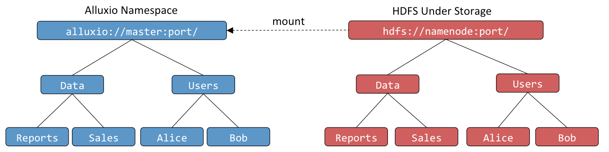

Tachyon enables effective data management across different storage systems through its use of transparent naming and mounting API.

## Transparent Naming

Transparent naming maintains an identity between the Tachyon namespace and the underlying storage system namespace.

When a user creates objects in the Tachyon namespace, they can choose whether these objects should be persisted in the underlying storage system. For objects that are persisted, Tachyon preserve the object paths, relative to the underlying storage system directory in which Tachyon objects are stored. For instance, if a user creates a top-level directory `Users` with subdirectories `Alice` and `Bob`, the directory structure and naming is preserved in the underlying storage system (e.g. HDFS or S3). Similarly, when a user renames or deletes a persisted object in the Tachyon namespace, it is renamed or deleted in the underlying storage system.

Furthermore, Tachyon transparently discovers content present in the underlying storage system which was not created through Tachyon. For instance, if the underlying storage system contains a directory `Data` with files `Reports` and `Sales`, all of which were not created through Tachyon, their metadata will be loaded into Tachyon the first time they are accessed (e.g. when the user asks to list the contents of the top-level directory or when they request to open a file).

## Mounting API

Mounting API makes it possible to use Tachyon to access data across multiple data sources.

By default, Tachyon namespace is mounted onto the directory specified by the `underfs.data.folder` property of Tachyon configuration; this directory identifies the "primary storage" for Tachyon. In addition, users can use the mounting API to add new and remove existing data sources:

	bool mount(String tachyonPath, String ufsPath)
	bool unmount(String tachyonPath)

For example, the primary storage could be HDFS and contain user directories; the `Data` directory might be in turned stored in an S3 bucket, which is mounted to the Tachyon namespace through the `mount(tachyon://host:port/Data, s3://host/bucket)` invocation.

## Example

In this example, we will showcase the above features. The example assumes that Tachyon source code exists in the `${TACHYON_HOME}` directory and that there is an instance of Tachyon running locally.

First, let's create a temporary directory in the local file system that to use for the example:

	$ cd /tmp
	$ mkdir tachyon-demo

Next, let's mount the directory created above into Tachyon and verify the mounted directory is created in Tachyon:

	$ ${TACHYON_HOME}/bin/tachyon tfs mount /demo /tmp/tachyon-demo
	> Mounted /tmp/tachyon-demo at /demo
	$ ${TACHYON_HOME}/bin/tachyon tfs ls /
	... # should contain /demo

Next, let's create two files under the mounted directory and verify it is created in the underlying file system:

	$ ${TACHYON_HOME}/bin/tachyon tfs touch /demo/hello
	> /demo/hello has been created
	$ ${TACHYON_HOME}/bin/tachyon tfs touch /demo/hello2
	> /demo/hello2 has been created
	$ ls /tmp/tachyon-demo
	> hello	hello2

Next, let's rename one of the files and verify it is renamed in the underlying file system:

	$ ${TACHYON_HOME}/bin/tachyon tfs mv /demo/hello2 /demo/world
	> Renamed /demo/hello2 to /demo/world
	$ ls /tmp/tachyon-demo
	> hello world

Next, let's delete one of the files and verify it is deleted in the underlying file system:

	$ ${TACHYON_HOME}/bin/tachyon tfs rm /demo/world
	> /demo/world has been removed
	$ ls /tmp/tachyon-demo
	> hello

Finally, let's unmount the mounted directory and verify that it is removed from the Tachyon namespace, but it contents are preserved in the underlying file system:

	${TACHYON_HOME}/bin/tachyon tfs unmount /demo
	> Unmounted /demo
	$ ${TACHYON_HOME}/bin/tachyon tfs ls /
	... # should not contain /demo
	$ ls /tmp/tachyon-demo
	> hello
