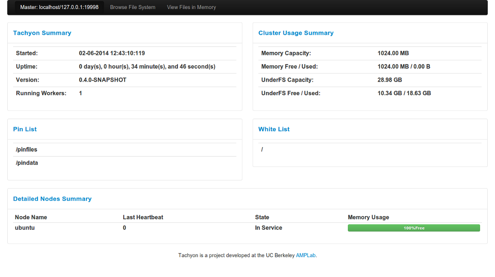
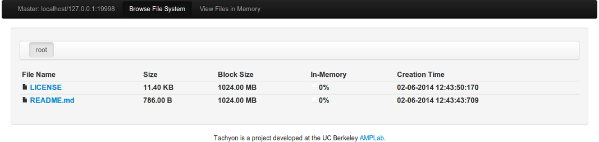
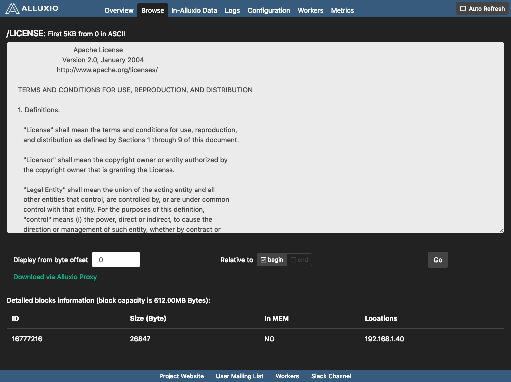

Tachyon has a user-friendly web interface allowing users to watch and manage the system. Below we
describe its homepage, browsing page, and file page.

The **home page** gives an overview of the system's status.

To browse the list of file, click "Browse File System" button. In **browsing page**, files in the
current folder are listed, with the file name, file size, size for each block, the percentage of
in-memory data, and the creation time. To view the content of a file in detail, click on that file.

## File content page

**File page** displays file's content and its block information. When the size of the file is large,
the page only shows the first 5KB from a specified start position. To change the start position,
enter the position in the input bar beside "Go" button and click "Go".

