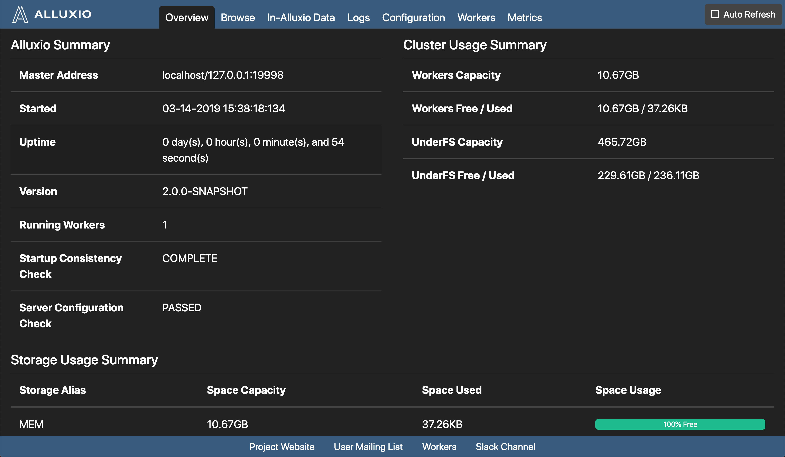
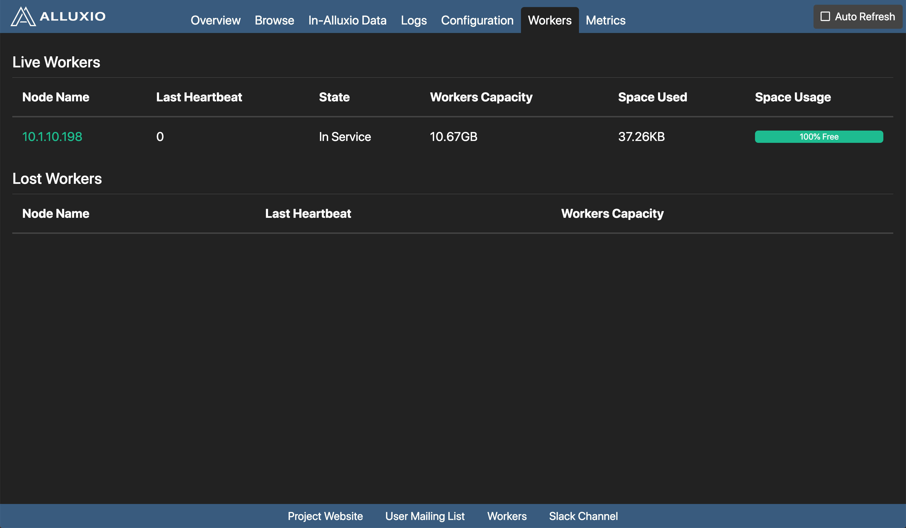
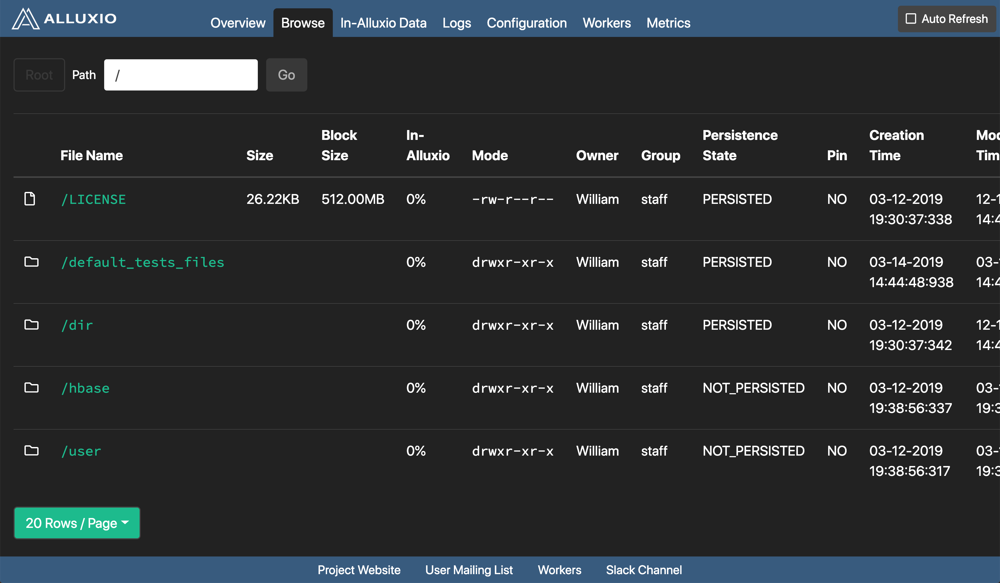
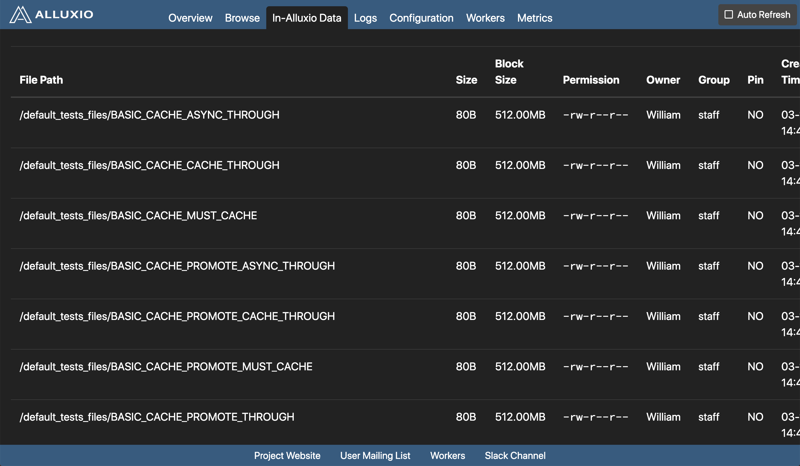

Tachyon has a user-friendly web interface allowing users to watch and manage the system. The master and workers all serve their own web UI. The default port for the web interface is 19999 for the master and 30000 for the worker.

# Master Web Interface

## Home Page

The home page gives an overview of the system's status. It includes the following sections:

* **Tachyon Summary**

    Tachyon system level information

* **Cluster Usage Summary**

    Tachyon storage information as well as under storage information. Tachyon storage utilization can be near 100%, but under storage utilization should not approach 100%.

* **Storage Usage Summary**

    Tachyon tiered storage information which gives a break down of amount of space used per tier.

## Workers Page

To access the worker status page, click the **workers** button in the navbar on the top of the screen. The workers page gives an overview of all Tachyon worker nodes divided into two sections:

* **Live Nodes**

    A list of all the workers currently serving Tachyon requests. Clicking on the worker name will redirect to the worker's web UI.

* **Dead Nodes**

    A list of all workers proclaimed as dead by the master, usually due to a long timeout waiting for the worker heartbeat. Possible causes include system restart or network failures.

## Configuration Page

To check the current system configuration information, click "System Configuration" in the navbar on the top of the screen. The configuration page has two sections:

* **Tachyon Configuration**

	A map of all the Tachyon configuration strings and their set values.

* **White List**

    Contains all the paths eligible to be Stored in Tachyon. A request may still be made to a file not in the white list. Only white listed files will be stored in Tachyon.

## Browse Filesystem

To browse the list of files, click "Browse File System" in the navbar on the top of the screen. In the **browsing page**, files in the current folder are listed, with the file name, file size, size for each block, the percentage of in-memory data, and the creation time. To view the content of a file in detail, click on that file.

## Browse In-Memory Files

To browse all in-memory files, click the "In Memory Files" button. In the **in memory files page**, files, currently in memory are listed, with the file name, file size, size for each block, whether the file is pinned or not, the file creation time, and the file modification time.
