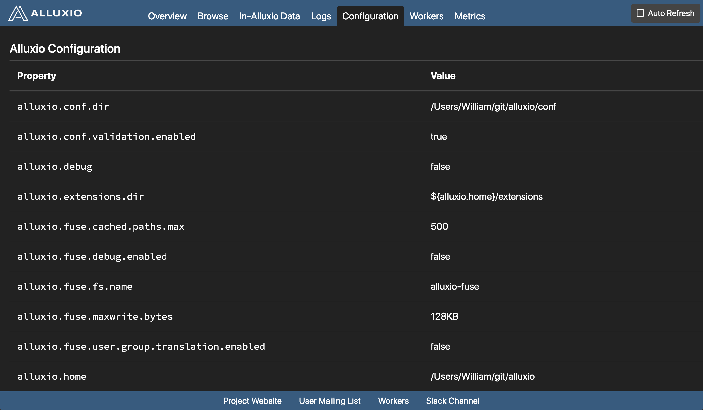

Tachyon has a user-friendly web interface allowing users to watch and manage the system. Below we
describe its details.

The **home page** gives an overview of the system's status. It includes the following sections:
1. Tachyon Summary, which shows the master address, cluster start time and uptime, tachyon
version used, number of running workers.
2. Cluster Usage Summary, which shows total workers capacity in bytes, free bytes, used bytes,
under file system capacity as well as free and used bytes.
3. Storage Usage Summary, which shows the space capacity, space used of each tier (e.g. MEM, SSD
, HDD) of the storage hierarchy.

To check the list of all workers, click "Workers" button. In **workers page**, all nodes are listed,
also the last heartbeat, node state, workers capacity, space used in bytes, as well as space
usage percentage are presented.

To check current system configuration information, click "System Configuration" button.

To browse the list of files, click "Browse File System" button. In **browsing page**, files in the
current folder are listed, with the file name, file size, size for each block, the percentage of
in-memory data, and the creation time. To view the content of a file in detail, click on that file.

To browse all in-memory files, click "In Memory Files" button. In **in memory files page**, files
currently in memory are listed, with the file name, file size, size for each block, whether the
file is pinned or not, the file creation time, and the file modification time.

