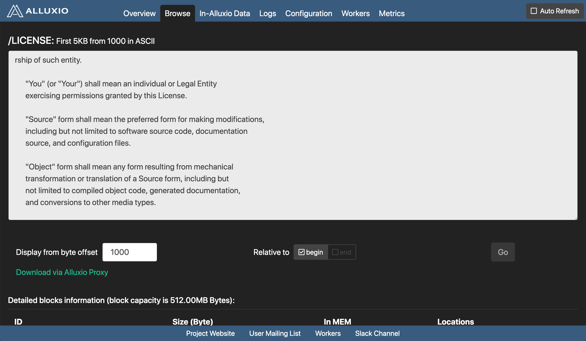

# Web Interface

Tachyon has a user-friendly web interface facilitating users to watch and manage Tachyon. 

## Home page
The home page shows a summary of Tachyon.  

To browse the list of file, click "Browse File System" button. 

## Folder browsing page
In file browsing page, files in current folder is listed, with the information of their name, size, size for each block, the percentage of in-memory blocks, and the creation time of the file. To view the content of a file in detail, select a file arbitrarily.

## File content page

In the file content page, the blocks information is displayed besides the file content. 

Sometimes, the size of the file can be extremely large. So in this page, only first 5KB from a specified start position is displayed. To change the start position, enter the position in the input bar beside "Go" button and click "Go". 

